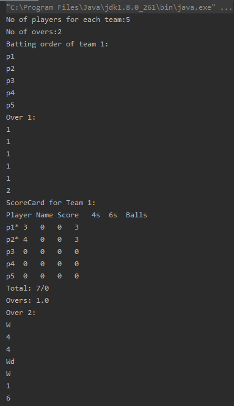
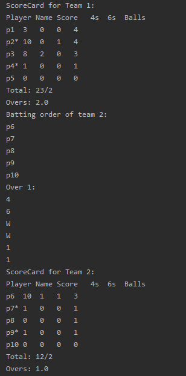
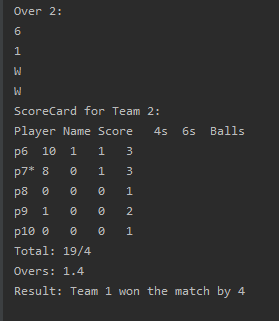

# Cricket Score Card
Design a cricket scorecard that will show the score for a team along with score of each player.
You will be given the number of players in each team, the number of overs and their batting
order as input. Then, we can input overs ball by ball with the runs scored on that ball (could be
wide, no ball or a wicket as well).
* You are expected to print individual scores, number of balls faced, number of 4s, number of 6s
for all the players from the batting side at the end of every over. You also need to print total
score, total wickets. Essentially, you need to keep a track of all the players, strike changes (at
the end of the over or after taking singles or 3s) and maintain their scores, also keep track of
extra bowls that are being bowled (like wides or no balls). You also need to print which team
won the match at the end.
* This is the bare minimum solution which is expected for the problem. You can add some more
features once you are done with these, like maintaining bowlers record (total overs bowled, runs
conceded, wickets taken, maiden overs, dot balls, economy, etc.). Total team extras, batsman
strike rates, etc. can be added too. But these are "good to have" features, please try to complete
the bare minimum first.
Make sure your code is readable and maintainable and preferably object oriented. It should be
modular and extensible, to add new features if needed.

## Screenshots





## Requirements

- Java Version 8 or higher.

## Installation

- Press the Fork button (top right the page) to save a copy of this project on your account.

- Download the repository files (project) from the download section or clone this project by typing in the bash the following command:

```git
git clone https://github.com/codenuj/cricket.git
```
- Imported it in Intellij IDEA or any other Java IDE.

- Run the application.

> Happy Coding
